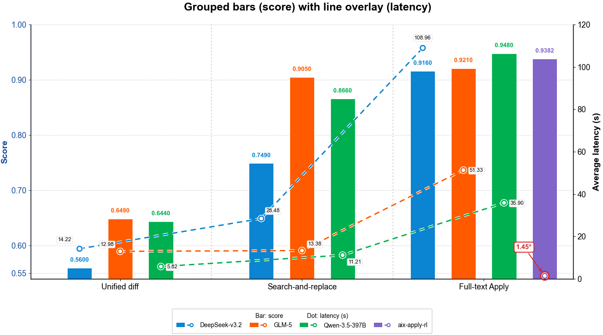
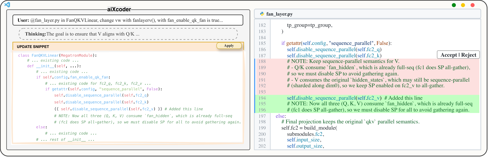
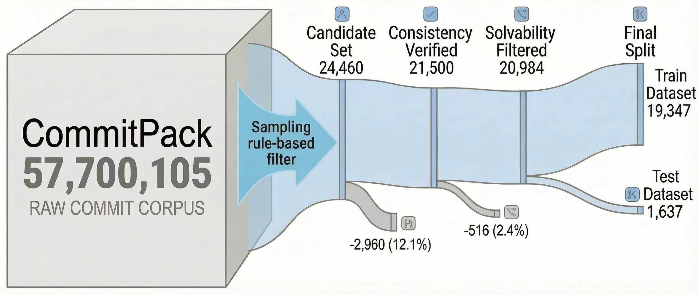

# aiXapply

[English](README.md) | [Chinese](README_CN.md)

<p align="center">
  <a href="#overview">Overview</a> |
  <a href="#resources">Resources</a> |
  <a href="#quick-start">Quick Start</a> |
  <a href="#continue-integration">Continue Integration</a> |
  <a href="#dataset">Dataset</a> |
  <a href="#training">Training</a> |
  <a href="#evaluation">Evaluation</a> |
  <a href="#results">Results</a> |
  <a href="#citation">Citation</a>
</p>

<p align="center">
  <a href="LICENSE"></a>
  = 3.10">
  
  
  
  
  
</p>

**aiXapply** is a specialized 4B model and open-source toolkit for **Full-File Apply**: given an original file and a localized update snippet, it generates the complete updated file while preserving everything outside the requested edit.



*Figure 1: Accuracy-latency comparison across unified diff, search-and-replace, and full-file Apply. aiXapply-RL keeps full-file Apply accuracy while reducing latency to an interactive range.*

This repository is the official artifact repository for paper:

> **AiXapply: Fast and Reliable Full-File Code Integration with Specialized Small Models for IDE Workflows**

## Overview

Modern coding assistants often produce a local edit snippet first. The hard downstream step is applying that snippet to the original file without changing unrelated code. Unified diffs are compact but brittle, and search-and-replace is easy to generate but depends on exact string matching. aiXapply treats this downstream step as a standalone code-integration task.



*Figure 2: aiXapply in an IDE workflow. An upstream coding assistant proposes an update snippet, aiXapply expands it into a complete updated file, and the IDE presents the resulting diff for review.*

The repository includes:

| Component | Path |
| --- | --- |
| OpenAI-compatible inference scripts | `experiments/aiXapply/` |
| Experiment entrypoints for full-file Apply, unified diff, and search-and-replace | `experiments/` |
| Shared evaluation and six-class error taxonomy | `experiments/evaluation/` |
| Multi-language data construction pipeline | `data_generation/` |
| SFT and RL training scripts | `training/sft/`, `training/rl/` |
| Continue IDE integration adapter | `continue_config/` |

### Highlights

- **High accuracy**: aiXapply-SFT reaches **94.4%** average equivalence accuracy on the 1,637-sample main benchmark, close to Qwen3.5-397B-A17B (94.8%) and above DeepSeek-V3.2 (91.6%).
- **Fast full-file generation**: with n-gram speculative decoding, aiXapply reaches **1.06s** average latency and **2692 tokens/s** on a single A100 40GB GPU.
- **Deployment-ready apply backend**: the model can be served behind an OpenAI-compatible endpoint and used as a dedicated `apply` model in Continue.
- **Reproducible pipeline**: data generation, training, inference, scoring, and error classification scripts are included.

## Resources

This release is split into one GitHub repository and three Hugging Face artifacts:

| Artifact        | Release target                                                                      | Description                                                                                                                                                                                   |
| --------------- | ----------------------------------------------------------------------------------- | --------------------------------------------------------------------------------------------------------------------------------------------------------------------------------------------- |
| Code repository | [GitHub](https://github.com/aixcoder-plugin/aiXapply-4B)                            | Open-source project repository containing inference scripts, data construction code, training recipes, evaluation tools, Continue integration, and documentation.                             |
| Test dataset    | [Hugging Face Dataset](https://huggingface.co/datasets/aiXcoder/aiXapply_test_data) | Public evaluation set for Full-File Apply, covering 20 programming languages and file formats. Use this artifact to reproduce benchmark scores without rebuilding the training data pipeline. |
| RL model        | [Hugging Face Model](https://huggingface.co/aiXcoder/aiXapply-4B-RL)                | 4B Apply model post-trained with reinforcement learning / GRPO. It is optimized for task-level correctness, locality, and robustness under alternative edit representations.                  |
| SFT model       | [Hugging Face Model](https://huggingface.co/aiXcoder/aiXapply-4B-SFT)              | 4B Apply model trained with supervised fine-tuning. It provides strong in-distribution accuracy and better long-context structural preservation in our experiments.                           |


## Task Definition

Full-File Apply takes:

```text
<language>{language}</language>
<source_file>{original full file}</source_file>
<update_snippet>{localized update snippet}</update_snippet>
```

and returns:

```text
<update_file>{complete updated file}</update_file>
```

The task has three core requirements:

- **Complete output**: the model must return the full updated file, not a patch or partial fragment.
- **No side effects**: content outside the requested edit region should remain identical to the source file.
- **Placeholder expansion**: markers such as `// ... existing code ...` mean "copy the corresponding original content exactly"; placeholders must not appear in the final output.

If anchors in the update snippet are ambiguous or cannot be located safely, the model should fail conservatively rather than hallucinate an unrelated edit.

## Quick Start

### Install

```bash
git clone --depth 1 --recurse-submodules https://github.com/aixcoder-plugin/aiXapply-4B.git
cd aiXapply-4B

python -m venv .venv
source .venv/bin/activate
python -m pip install --upgrade pip
python -m pip install -e .
```

The Python package is named `aixapply` and requires Python 3.10 or newer. Editable installation reads dependencies from `requirements.txt` through `pyproject.toml` and exposes the repository packages used by the scripts: `data_generation`, `experiments`, and `training`.

The veRL code used by RL training is kept as a git submodule. If you cloned without `--recurse-submodules`, run `git submodule update --init --recursive` before using the RL scripts.

For model serving, install a `vllm` build compatible with your CUDA and PyTorch environment.

### Serve a Model with vLLM

```bash
export WEIGHT_DIR=/path/to/aiXapply-4B-RL  # or /path/to/aiXapply-4B-SFT
export SERVE_MODEL_NAME=aiXapply-4B-RL

CUDA_VISIBLE_DEVICES=0 vllm serve "$WEIGHT_DIR" \
  --host 0.0.0.0 \
  --port 12003 \
  --served-model-name "$SERVE_MODEL_NAME" \
  --tensor-parallel-size 1 \
  --enable-chunked-prefill \
  --kv-cache-dtype auto \
  --max-num-batched-tokens 4096 \
  --max-model-len 32768 \
  --gpu-memory-utilization 0.95 \
  --speculative-config '{"method":"ngram","num_speculative_tokens":128,"prompt_lookup_max":7}'
```

Use `--max-model-len 262144` only if your serving setup has enough memory for the full long-context configuration.

### Call the Endpoint

```python
from openai import OpenAI

client = OpenAI(base_url="http://127.0.0.1:12003/v1", api_key="local")

system_prompt = """You are a deterministic Code Patching Engine. Your task is to synthesize a "Updated File" by applying a partial "Update Snippet" to the provided "Source File".

### Algorithm
1. **Context Matching**: Analyze the `Update Snippet` to identify the context anchors (the lines of code surrounding the changes). Locate the exact corresponding block in the `Source File`. The match must be unique.
2. **Code Merging**: Replace the matched block in the `Source File` with the logic from the `Update Snippet`.
3. **Expansion**: The `Update Snippet` contains omission markers (e.g., `// ... existing code ...`). You MUST replace these markers with the original, unchanged lines from the `Source File`.
4. **Output Generation**: Output the FULL content of the resulting file.

### Constraints
- **NO Laziness**: Never output comments like `// ... rest of code ...` in the final output. You must write out every single line of the final code.
- **Strict Fidelity**: Preserve the original indentation style (spaces/tabs) and comments of the Source File for all unchanged parts.
- **Safety**: If the context in the snippet is ambiguous or cannot be found, output nothing inside the tags.

### Output Format
<update_file>[Your final code here]</update_file>"""

user_prompt = """<language>{language}</language>

<source_file>{source_file}</source_file>

<update_snippet>{update_snippet}</update_snippet>

Please generate the full updated code strictly following the instructions."""


LANGUAGE = "python"
SOURCE_FILE = """def add(a, b):
    return a + b

def main():
    print(add(1, 2))
"""
UPDATE_SNIPPET = """#  ... existing code ...
def main():
    print(add(7, 8))
"""


response = client.chat.completions.create(
    model="aiXapply-4B-RL",
    messages=[
        {"role": "system", "content": system_prompt},
        {"role": "user", "content": user_prompt.format(language=LANGUAGE, source_file=SOURCE_FILE, update_snippet=UPDATE_SNIPPET)},
    ],
    temperature=0.3,
)

print(response.choices[0].message.content)
```

## Continue Integration

`continue_config/` contains an adapter for using aiXapply as Continue's dedicated Apply backend.

The recommended local workflow is:

```text
Continue -> continue_apply_proxy.py -> OpenAI-compatible aiXapply endpoint
```

Start the proxy:

```bash
cd continue_config
export APPLY_PROXY_UPSTREAM_CHAT_URL="http://127.0.0.1:12003/v1/chat/completions"
export APPLY_PROXY_HOST="127.0.0.1"
export APPLY_PROXY_PORT="14124"
python3 continue_apply_proxy.py
```

Then merge the `apply` model block from `continue_config/continue.config.yaml.example` into your Continue config. The proxy strips `<update_file>...</update_file>` tags before returning the result to Continue and supports streaming responses.

See [continue_config/README.md](continue_config/README.md) for configuration details and troubleshooting.

## Dataset

The public test dataset is released separately on Hugging Face. It contains the benchmark examples used to evaluate aiXapply and comparable models. Each example follows the Apply format:

```text
<source_file, update_snippet, update_file>
```

The broader training-data construction pipeline is included in this repository. It synthesizes Apply examples from real-world commits, including CommitPack-style records with `(old_file, new_file, commit_message)`.



*Figure 3: Dataset construction pipeline. Raw CommitPack records are sampled, consistency-verified, solvability-filtered, and split into train/test sets.*

High-level pipeline:

1. **Sampling and filtering**: keep localized same-file edits and balance languages/formats.
2. **Change description generation**: make the intent of each commit explicit.
3. **Snippet synthesis**: produce a localized `update_snippet` and full-file ground truth.
4. **Consistency verification**: ensure every diff is explained by the snippet and no extra change is introduced.
5. **Solvability filtering**: remove ambiguous or non-reproducible samples, then convert to training format.

Dataset scale:

| Split | Samples | Notes |
| --- | ---: | --- |
| Train | 19,347 | Multi-language Apply training examples |
| Test | 1,637 | Public Hugging Face test dataset |

The test set covers C, C++, Dockerfile, Go, HTML, INI, Java, JavaScript, JSON, Makefile, Markdown, Python, reStructuredText, Rust, Shell, SQL, Text, TypeScript, XML, and YAML.

See [data_generation/README.md](data_generation/README.md) for scripts, configs, and reconstruction steps.

## Training

aiXapply is trained from a Qwen3-4B backbone with two complementary strategies:

- **SFT**: direct supervised learning from `(source_file, update_snippet)` to `update_file`.
- **RL / GRPO**: task-level optimization with rewards based on equivalence, patch correctness, and side-effect penalties.

The released model artifacts are `aiXapply-4B-SFT` and `aiXapply-4B-RL`. Use the SFT model as the default choice for high full-file Apply accuracy and long-context fidelity; use the RL model when you want the RL-aligned variant used in the latency/accuracy frontier and cross-format experiments.

### SFT

SFT training can use the same `verlai/verl:vllm011.latest` image as the veRL/RL environment below. Inside that container, install the SFT-specific dependencies from `training/sft/requirements.txt`:

```bash
python -m pip install -r training/sft/requirements.txt

cd training/sft
WANDB_PROJECT=aiXapply_sft \
WANDB_RUN_NAME=qwen3-4b-sft \
accelerate launch --config_file fsdp_config.yaml run_sft.py \
  --train_dataset_path /path/to/train.parquet \
  --test_dataset_path /path/to/test.parquet \
  --model_name /path/to/Qwen3-4B \
  --output_dir checkpoints/full_finetune
```

Update `training/sft/fsdp_config.yaml` for your machine, especially `num_processes` and context-parallel settings.

Set `REPORT_TO=none` if you do not want SFT runs to report to Weights & Biases.

### RL / GRPO

The RL setup uses veRL through the `training/rl/verl` git submodule. Make sure the submodule is initialized before running RL training:

```bash
git submodule update --init --recursive
```

A typical training environment can be started with:

```bash
docker pull verlai/verl:vllm011.latest

export WORKSPACE=/path/to/workspace
docker create -it --runtime=nvidia --gpus all --net=host --ipc=host \
  --cap-add=SYS_ADMIN \
  -v "$WORKSPACE:$WORKSPACE" \
  --entrypoint /bin/bash \
  --name aixapply_verl \
  verlai/verl:vllm011.latest \
  -c "sleep infinity"

docker start aixapply_verl
docker exec -it aixapply_verl bash
```

Inside the container:

```bash
cd training/rl/verl
pip install -e .
pip install -e .[sglang]
cd ../../..

cd training/rl
MODEL_PATH=/path/to/Qwen3-4B \
TRAIN_FILES=/path/to/train.parquet \
TEST_FILES=/path/to/test.parquet \
bash run_qwen3-4b_sgl_megatron_multi_grpo.sh
```

`TRAIN_FILES` and `TEST_FILES` must point to parquet files prepared by the data-generation pipeline or to equivalent public training data. The RL script logs to console and W&B by default; append `trainer.logger='["console"]'` to the command if you want to disable W&B for local runs.

Training is resource-intensive; the paper experiments use multi-GPU A100-class hardware.

## Evaluation

Run inference:

```bash
python experiments/aiXapply/infer_openai.py \
  --provider local \
  --data-path /path/to/main_test_data.parquet
```

The `local` provider in `experiments/aiXapply/infer_openai.py` expects an OpenAI-compatible endpoint at `http://127.0.0.1:12003/v1`. If you serve the model on a different port or with a different served model name, update the local provider config in that script before running evaluation.

Score predictions:

```bash
python experiments/evaluation/run_evaluation.py \
  -i predictions/xxx.jsonl \
  --classify_errors
```

Optional LLM-assisted error classification:

```bash
export OPENAI_BASE_URL="http://your_endpoint/v1"
export OPENAI_MODEL="your_judge_model"

python experiments/evaluation/run_evaluation.py \
  -i predictions/xxx.jsonl \
  --classify_errors \
  --llm
```

The primary metric is **equivalence accuracy**:

- Code files are compared with Pygments token equivalence.
- Structured formats such as JSON, YAML, XML, and INI are parsed or classified as invalid when parsing fails.
- Errors can be grouped into `OUTPUT_INVALID`, `PATCH_NOT_APPLIED`, `PATCH_INCOMPLETE`, `PATCH_INCORRECT`, `WRONG_POSITION`, and `OUT_OF_PATCH_SIDE_EFFECT`.

See [experiments/README.md](experiments/README.md) and [experiments/evaluation/README.md](experiments/evaluation/README.md) for the full experiment layout.

## Results

### Main Benchmark

Average equivalence accuracy on the 1,637-example aiXapply test set:

| Model | Avg Accuracy |
| --- | ---: |
| Qwen3-4B baseline | 0.626 |
| Fast-Apply-7B | 0.620 |
| DeepSeek-V3.2 | 0.916 |
| GLM-5 | 0.921 |
| aiXapply-RL | 0.938 |
| aiXapply-SFT | 0.944 |
| Qwen3.5-397B-A17B | 0.948 |

### Editing Paradigms

Under the same DeepSeek-V3.2 model, full-file Apply improves one-shot accuracy over common edit representations:

| Representation | Accuracy | Avg Latency |
| --- | ---: | ---: |
| Unified diff | 0.560 | 14.22s |
| Search-and-replace | 0.749 | 28.48s |
| Full-file Apply | 0.916 | 108.96s |
| aiXapply-RL full-file Apply | 0.938 | 1.44s |

### Speculative Decoding

| Method | Avg Latency | P95 Latency | Throughput |
| --- | ---: | ---: | ---: |
| No speculation | 28.83s | 90.23s | 102.04 tokens/s |
| Suffix default | 5.75s | 20.74s | 509.54 tokens/s |
| N-gram default | 2.17s | 6.94s | 1343.99 tokens/s |
| N-gram best (`n=7`, `k=128`) | 1.06s | 3.38s | 2692.01 tokens/s |

### Generalization

| Setting | DeepSeek-V3.2 | aiXapply-RL | aiXapply-SFT |
| --- | ---: | ---: | ---: |
| Long context | 0.588 | 0.647 | 0.843 |
| Untrained languages avg. | 0.932 | 0.938 | 0.941 |
| Random placeholders avg. | 0.932 | 0.948 | 0.951 |
| Chunk file avg. | 0.850 | 0.881 | 0.900 |

## Repository Notes

- The current release focuses on single-file Apply. Multi-file edits and interactive multi-step editing are future work.
- aiXapply optimizes deterministic integration, not semantic validation. You should still run tests and review generated diffs before accepting edits.
- Do not commit secrets, checkpoints, datasets, or generated prediction artifacts unless they are intentionally part of a release.

## Contributing

Contributions are welcome. Please read [CONTRIBUTING.md](CONTRIBUTING.md) before opening issues or pull requests.

For useful bug reports, include the script or endpoint you ran, the command/configuration, the observed output or traceback, and enough model/provider context to reproduce the problem.

## License

This repository is licensed under the Apache License 2.0. See [LICENSE](LICENSE) for details.

## Citation

If you find aiXapply useful, please cite:

```bibtex
@misc{jiang2026aixapply,
  title = {AiXapply: Fast and Reliable Full-File Code Integration with Specialized Small Models for IDE Workflows},
  author = {Jiang, Siyuan and Cai, Xiang and Wang, Peixu and Han, Yu and Dong, Yihong and Ning, Wei and Guo, Xuyuan and Wen, Jincheng and Zhao, Wei and Li, Ge},
  year = {2026},
  url = {https://github.com/aixcoder-plugin/aiXapply-4B}
}
```
