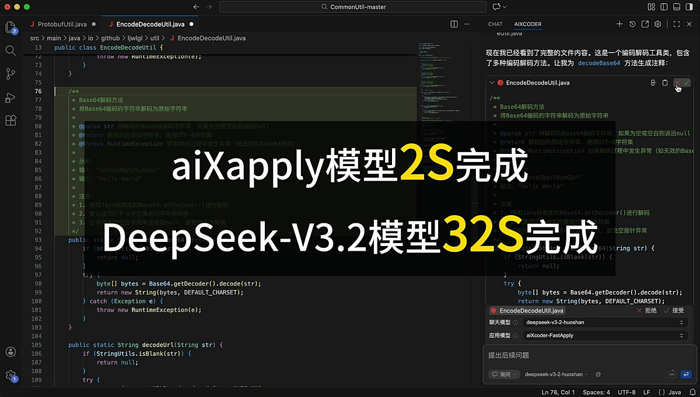

# aiXapply

[English](README.md) | [中文](README_CN.md)

<p align="center">
  <a href="#项目简介">项目简介</a> |
  <a href="#资源">资源</a> |
  <a href="#快速开始">快速开始</a> |
  <a href="#continue-集成">Continue 集成</a> |
  <a href="#数据集">数据集</a> |
  <a href="#训练">训练</a> |
  <a href="#评估">评估</a> |
  <a href="#结果">结果</a> |
  <a href="#引用">引用</a>
</p>

<p align="center">
  <a href="LICENSE"></a>
  
  
  
  
  
</p>

**aiXapply** 是一个面向 **Full-File Apply** 的 4B 专用模型与开源工具链：给定原始文件和局部更新片段，模型输出完整的更新后文件，并尽量保证请求修改区域之外的内容完全不变。


*图 1：unified diff、search-and-replace 与 full-file Apply 的准确率-延迟对比。aiXapply-RL 在保持 Full-File Apply 准确率优势的同时，将延迟降低到交互式可用范围。*


在实际开发场景中，aiXcoder 编程AI助手 加载 aiXapply 与 DeepSeek 速度对比：




本仓库是以下论文的官方开源 artifact 仓库：

> **AiXapply: Fast and Reliable Full-File Code Integration with Specialized Small Models for IDE Workflows**

## 项目简介

现代编程助手通常会先生成一个局部编辑片段。真正困难的下游步骤，是把这个片段可靠地应用到原始文件中，同时不改动无关代码。Unified diff 表示紧凑但格式脆弱，search-and-replace 更容易生成但依赖精确字符串匹配。aiXapply 将这个下游步骤作为独立的代码集成任务来建模。


*图 2：aiXapply 在 IDE 工作流中的位置。上游编程助手生成更新片段，aiXapply 将其展开为完整更新文件，IDE 再展示 diff 供用户审查。*

本仓库包含：

| 组件 | 路径 |
| --- | --- |
| OpenAI 兼容推理脚本 | `experiments/aiXapply/` |
| Full-file Apply、unified diff、search-and-replace 实验入口 | `experiments/` |
| 统一评测与 6 类错误分类体系 | `experiments/evaluation/` |
| 多语言数据构建管线 | `data_generation/` |
| SFT 与 RL 训练脚本 | `training/sft/`, `training/rl/` |
| Continue IDE 集成适配器 | `continue_config/` |

### 亮点

- **高准确率**：aiXapply-SFT 在 1,637 条主测试集上达到 **94.4%** 平均等价准确率，接近 Qwen3.5-397B-A17B（94.8%），高于 DeepSeek-V3.2（91.6%）。
- **快速全文件生成**：借助 n-gram speculative decoding，aiXapply 在单张 A100 40GB GPU 上达到 **1.06s** 平均延迟与 **2692 tokens/s** 吞吐。
- **可部署的 Apply 后端**：模型可通过 OpenAI 兼容接口提供服务，并作为 Continue 中专用的 `apply` 模型使用。
- **可复现流程**：仓库包含数据生成、训练、推理、打分和错误分类脚本。

## 资源

本次发布包含一个 GitHub 仓库和三个 Hugging Face artifact：

| Artifact | 发布地址 | 说明 |
| --- | --- | --- |
| 代码仓库 | [GitHub](https://github.com/aixcoder-plugin/aiXapply-4B) | 开源项目仓库，包含推理脚本、数据构建代码、训练配置、评测工具、Continue 集成与文档。 |
| 测试数据集 | [Hugging Face Dataset](https://huggingface.co/datasets/aiXcoder/aiXapply_test_data) | Full-File Apply 公开评测集，覆盖 20 种编程语言和文件格式。可用于复现实验结果，无需重新构建训练数据管线。 |
| RL 模型 | [Hugging Face Model](https://huggingface.co/aiXcoder/aiXapply-4B-RL) | 经过 reinforcement learning / GRPO 后训练的 4B Apply 模型，优化任务级正确性、局部性和不同编辑表示下的鲁棒性。 |
| SFT 模型 | [Hugging Face Model](https://huggingface.co/aiXcoder/aiXapply-4B-SFT) | 经过 supervised fine-tuning 的 4B Apply 模型，在实验中表现出较强的主任务准确率和长上下文结构保持能力。 |

## 任务定义

Full-File Apply 的输入为：

```text
<language>{language}</language>
<source_file>{original full file}</source_file>
<update_snippet>{localized update snippet}</update_snippet>
```

输出为：

```text
<update_file>{complete updated file}</update_file>
```

任务有三个核心要求：

- **完整输出**：模型必须输出完整更新后文件，而不是 patch 或局部片段。
- **无副作用**：请求修改区域之外的内容应与原始文件保持一致。
- **占位符展开**：`// ... existing code ...` 等标记表示“从原始文件中精确拷贝对应内容”；占位符不应出现在最终输出中。

如果更新片段中的上下文锚点存在歧义或无法安全定位，模型应保守失败，而不是臆造无关修改。

## 快速开始

### 安装

```bash
git clone --depth 1 --recurse-submodules https://github.com/aixcoder-plugin/aiXapply-4B.git
cd aiXapply-4B

python -m venv .venv
source .venv/bin/activate
python -m pip install --upgrade pip
python -m pip install -e .
```

RL 训练依赖的 veRL 代码以 git submodule 形式保留。如果 clone 时没有使用 `--recurse-submodules`，请在运行 RL 脚本前执行 `git submodule update --init --recursive`。

如需模型服务，请安装与当前 CUDA / PyTorch 环境兼容的 `vllm`。

### 使用 vLLM 启动模型服务

```bash
export WEIGHT_DIR=/path/to/aiXapply-4B-RL  # 或 /path/to/aiXapply-4B-SFT
export SERVE_MODEL_NAME=aiXapply-4B-RL

CUDA_VISIBLE_DEVICES=0 vllm serve "$WEIGHT_DIR" \
  --host 0.0.0.0 \
  --port 12003 \
  --served-model-name "$SERVE_MODEL_NAME" \
  --tensor-parallel-size 1 \
  --enable-chunked-prefill \
  --kv-cache-dtype auto \
  --max-num-batched-tokens 4096 \
  --max-model-len 32768 \
  --gpu-memory-utilization 0.95 \
  --speculative-config '{"method":"ngram","num_speculative_tokens":128,"prompt_lookup_max":7}'
```

只有当服务环境有足够显存支持完整长上下文配置时，才建议使用 `--max-model-len 262144`。

### 调用接口

```python
from openai import OpenAI

client = OpenAI(base_url="http://127.0.0.1:12003/v1", api_key="local")

system_prompt = """You are a deterministic Code Patching Engine. Your task is to synthesize a "Updated File" by applying a partial "Update Snippet" to the provided "Source File".

### Algorithm
1. **Context Matching**: Analyze the `Update Snippet` to identify the context anchors (the lines of code surrounding the changes). Locate the exact corresponding block in the `Source File`. The match must be unique.
2. **Code Merging**: Replace the matched block in the `Source File` with the logic from the `Update Snippet`.
3. **Expansion**: The `Update Snippet` contains omission markers (e.g., `// ... existing code ...`). You MUST replace these markers with the original, unchanged lines from the `Source File`.
4. **Output Generation**: Output the FULL content of the resulting file.

### Constraints
- **NO Laziness**: Never output comments like `// ... rest of code ...` in the final output. You must write out every single line of the final code.
- **Strict Fidelity**: Preserve the original indentation style (spaces/tabs) and comments of the Source File for all unchanged parts.
- **Safety**: If the context in the snippet is ambiguous or cannot be found, output nothing inside the tags.

### Output Format
<update_file>[Your final code here]</update_file>"""

user_prompt = """<language>{language}</language>

<source_file>{source_file}</source_file>

<update_snippet>{update_snippet}</update_snippet>

Please generate the full updated code strictly following the instructions."""


LANGUAGE = "python"
SOURCE_FILE = """def add(a, b):
    return a + b

def main():
    print(add(1, 2))
"""
UPDATE_SNIPPET = """#  ... existing code ...
def main():
    print(add(7, 8))
"""


response = client.chat.completions.create(
    model="aiXapply-4B-RL",
    messages=[
        {"role": "system", "content": system_prompt},
        {"role": "user", "content": user_prompt.format(language=LANGUAGE, source_file=SOURCE_FILE, update_snippet=UPDATE_SNIPPET)},
    ],
    temperature=0.3,
)

print(response.choices[0].message.content)
```

## Continue 集成

`continue_config/` 提供了将 aiXapply 作为 Continue 专用 Apply 后端的适配方案。

推荐的本地调用链路为：

```text
Continue -> continue_apply_proxy.py -> OpenAI-compatible aiXapply endpoint
```

启动代理：

```bash
cd continue_config
export APPLY_PROXY_UPSTREAM_CHAT_URL="http://127.0.0.1:12003/v1/chat/completions"
export APPLY_PROXY_HOST="127.0.0.1"
export APPLY_PROXY_PORT="14124"
python3 continue_apply_proxy.py
```

然后将 `continue_config/continue.config.yaml.example` 中的 `apply` 模型配置块合并到你的 Continue 配置中。代理会在返回 Continue 前自动去掉 `<update_file>...</update_file>` 标签，并支持流式响应。

配置细节和常见问题见 [continue_config/README.md](continue_config/README.md)。

## 数据集

公开测试集单独发布在 Hugging Face 上，包含用于评估 aiXapply 与对比模型的 benchmark 样本。每条样本遵循 Apply 格式：

```text
<source_file, update_snippet, update_file>
```

本仓库同时包含完整训练数据构建管线。该管线基于真实 commit 记录构造 Apply 样本，例如 CommitPack 风格的 `(old_file, new_file, commit_message)`。


*图 3：数据构建管线。原始 CommitPack 记录经过采样、规则过滤、一致性验证、可解性过滤后，最终切分为训练集和测试集。*

高层流程：

1. **采样与过滤**：保留局部单文件修改，并平衡语言/格式分布。
2. **修改说明生成**：显式化每个 commit 的修改意图。
3. **片段合成**：生成局部 `update_snippet` 与完整文件 ground truth。
4. **一致性验证**：确保所有 diff 都可由 snippet 解释，且不引入额外改动。
5. **可解性过滤**：移除有歧义或不可稳定复现的样本，并转换为训练格式。

数据规模：

| 切分 | 样本数 | 说明 |
| --- | ---: | --- |
| Train | 19,347 | 多语言 Apply 训练样本 |
| Test | 1,637 | Hugging Face 公开测试数据集 |

测试集覆盖 C、C++、Dockerfile、Go、HTML、INI、Java、JavaScript、JSON、Makefile、Markdown、Python、reStructuredText、Rust、Shell、SQL、Text、TypeScript、XML 和 YAML。

脚本、配置和数据重建步骤见 [data_generation/README.md](data_generation/README.md)。

## 训练

aiXapply 基于 Qwen3-4B backbone，并使用两种互补训练策略：

- **SFT**：从 `(source_file, update_snippet)` 到 `update_file` 的直接监督学习。
- **RL / GRPO**：基于等价性、patch 正确性和副作用惩罚的任务级优化。

发布的模型 artifact 包括 `aiXapply-4B-SFT` 与 `aiXapply-4B-RL`。如果关注 Full-File Apply 主任务准确率和长上下文结构保持，推荐优先使用 SFT 模型；如果希望复现延迟-准确率前沿或跨编辑格式实验，可使用 RL 模型。

### SFT

SFT 训练可复用下方 veRL/RL 训练环境中的 `verlai/verl:vllm011.latest` 镜像。进入容器后，使用 `training/sft/requirements.txt` 安装 SFT 依赖即可：

```bash
python -m pip install -r training/sft/requirements.txt

cd training/sft
WANDB_PROJECT=aiXapply_sft \
WANDB_RUN_NAME=qwen3-4b-sft \
accelerate launch --config_file fsdp_config.yaml run_sft.py \
  --train_dataset_path /path/to/train.parquet \
  --test_dataset_path /path/to/test.parquet \
  --model_name /path/to/Qwen3-4B \
  --output_dir checkpoints/full_finetune
```

请根据机器配置修改 `training/sft/fsdp_config.yaml`，尤其是 `num_processes` 和 context parallel 相关配置。

如果不希望 SFT 训练上报到 Weights & Biases，可以设置 `REPORT_TO=none`。

### RL / GRPO

RL 训练基于 `training/rl/verl` git submodule 中的 veRL。运行 RL 训练前请确认子模块已初始化：

```bash
git submodule update --init --recursive
```

典型训练环境可按以下方式启动：

```bash
docker pull verlai/verl:vllm011.latest

export WORKSPACE=/path/to/workspace
docker create -it --runtime=nvidia --gpus all --net=host --ipc=host \
  --cap-add=SYS_ADMIN \
  -v "$WORKSPACE:$WORKSPACE" \
  --entrypoint /bin/bash \
  --name aixapply_verl \
  verlai/verl:vllm011.latest \
  -c "sleep infinity"

docker start aixapply_verl
docker exec -it aixapply_verl bash
```

进入容器后：

```bash
cd training/rl/verl
pip install -e .
pip install -e .[sglang]
cd ../../..

cd training/rl
MODEL_PATH=/path/to/Qwen3-4B \
TRAIN_FILES=/path/to/train.parquet \
TEST_FILES=/path/to/test.parquet \
bash run_qwen3-4b_sgl_megatron_multi_grpo.sh
```

`TRAIN_FILES` 和 `TEST_FILES` 需要指向数据构建管线生成的 parquet 文件，或等价的公开训练数据。RL 脚本默认同时输出到 console 和 W&B；如果本地运行时不希望启用 W&B，可以在命令末尾追加 `trainer.logger='["console"]'`。

训练资源开销较大；论文实验使用的是多卡 A100 级别硬件。

## 评估

运行推理：

```bash
python experiments/aiXapply/infer_openai.py \
  --provider local \
  --data-path /path/to/test.parquet
```

`experiments/aiXapply/infer_openai.py` 中的 `local` provider 默认访问 `http://127.0.0.1:12003/v1`。如果模型服务端口或 served model name 不同，请先修改该脚本中的本地 provider 配置。

评估预测结果：

```bash
python experiments/evaluation/run_evaluation.py \
  -i predictions/xxx.jsonl \
  --classify_errors
```

如需启用 LLM 辅助错误分类：

```bash
export OPENAI_BASE_URL="http://your_endpoint/v1"
export OPENAI_MODEL="your_judge_model"

python experiments/evaluation/run_evaluation.py \
  -i predictions/xxx.jsonl \
  --classify_errors \
  --llm
```

主指标为 **equivalence accuracy**：

- 代码文件使用 Pygments token 等价比较。
- JSON、YAML、XML、INI 等结构化格式会尝试解析；解析失败会被归为 invalid。
- 错误可划分为 `OUTPUT_INVALID`、`PATCH_NOT_APPLIED`、`PATCH_INCOMPLETE`、`PATCH_INCORRECT`、`WRONG_POSITION`、`OUT_OF_PATCH_SIDE_EFFECT`。

完整实验结构见 [experiments/README.md](experiments/README.md) 与 [experiments/evaluation/README.md](experiments/evaluation/README.md)。

## 结果

### 主测试集

在 1,637 条 aiXapply 测试集上的平均等价准确率：

| 模型 | 平均准确率 |
| --- | ---: |
| Qwen3-4B baseline | 0.626 |
| Fast-Apply-7B | 0.620 |
| DeepSeek-V3.2 | 0.916 |
| GLM-5 | 0.921 |
| aiXapply-RL | 0.938 |
| aiXapply-SFT | 0.944 |
| Qwen3.5-397B-A17B | 0.948 |

### 编辑表示对比

在同一个 DeepSeek-V3.2 模型下，full-file Apply 相比常见编辑表示有更高的一次性成功率：

| 表示方式 | 准确率 | 平均延迟 |
| --- | ---: | ---: |
| Unified diff | 0.560 | 14.22s |
| Search-and-replace | 0.749 | 28.48s |
| Full-file Apply | 0.916 | 108.96s |
| aiXapply-RL full-file Apply | 0.938 | 1.44s |

### Speculative Decoding

| 方法 | 平均延迟 | P95 延迟 | 吞吐 |
| --- | ---: | ---: | ---: |
| 无 speculative decoding | 28.83s | 90.23s | 102.04 tokens/s |
| Suffix default | 5.75s | 20.74s | 509.54 tokens/s |
| N-gram default | 2.17s | 6.94s | 1343.99 tokens/s |
| N-gram best (`n=7`, `k=128`) | 1.06s | 3.38s | 2692.01 tokens/s |

### 泛化能力

| 设置 | DeepSeek-V3.2 | aiXapply-RL | aiXapply-SFT |
| --- | ---: | ---: | ---: |
| Long context | 0.588 | 0.647 | 0.843 |
| Untrained languages avg. | 0.932 | 0.938 | 0.941 |
| Random placeholders avg. | 0.932 | 0.948 | 0.951 |
| Chunk file avg. | 0.850 | 0.881 | 0.900 |


## 仓库说明

- 当前发布聚焦单文件 Apply。多文件修改与交互式多轮编辑是后续工作。
- aiXapply 优化的是确定性的代码集成步骤，而不是语义验证。接受修改前仍建议运行测试并审查 diff。
- 请勿提交 secrets、checkpoints、数据集或生成的预测 artifact，除非它们明确属于发布内容。

## 贡献

欢迎贡献。提交 Issue 或 Pull Request 前，请先阅读 [CONTRIBUTING.md](CONTRIBUTING.md)。

报告问题时，请尽量提供运行的脚本或 endpoint、命令/配置、实际输出或 traceback，以及足够复现问题的模型/服务商上下文。

## 许可证

本仓库采用 Apache License 2.0 许可证，详见 [LICENSE](LICENSE)。

## 引用

如果您觉得 aiXapply 对您有帮助，请引用：

```bibtex
@misc{jiang2026aixapply,
  title = {AiXapply: Fast and Reliable Full-File Code Integration with Specialized Small Models for IDE Workflows},
  author = {Jiang, Siyuan and Cai, Xiang and Wang, Peixu and Han, Yu and Dong, Yihong and Ning, Wei and Guo, Xuyuan and Wen, Jincheng and Zhao, Wei and Li, Ge},
  year = {2026},
  url = {https://github.com/aixcoder-plugin/aiXapply-4B}
}
```
