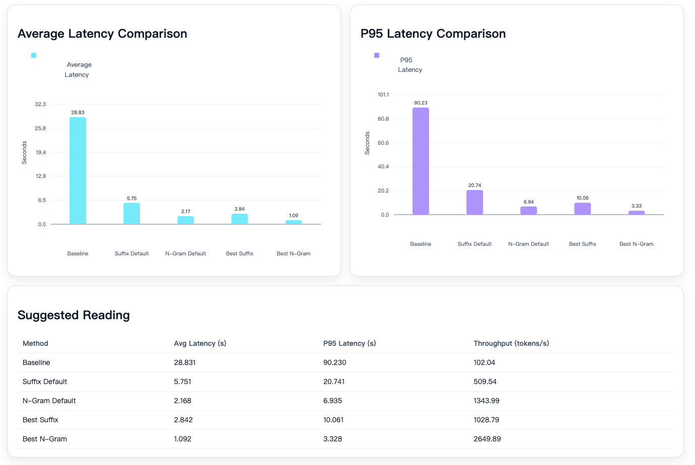
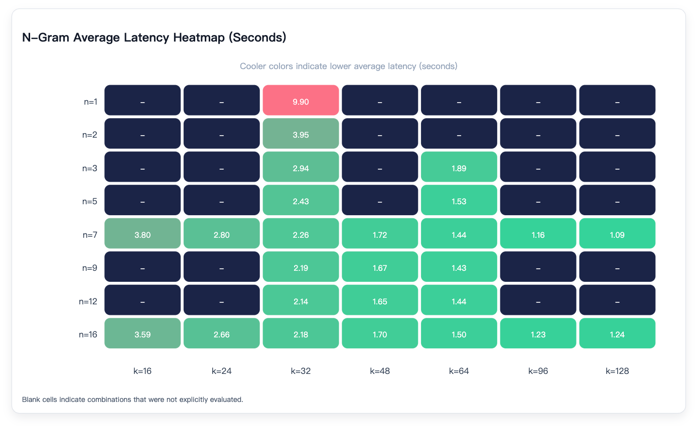
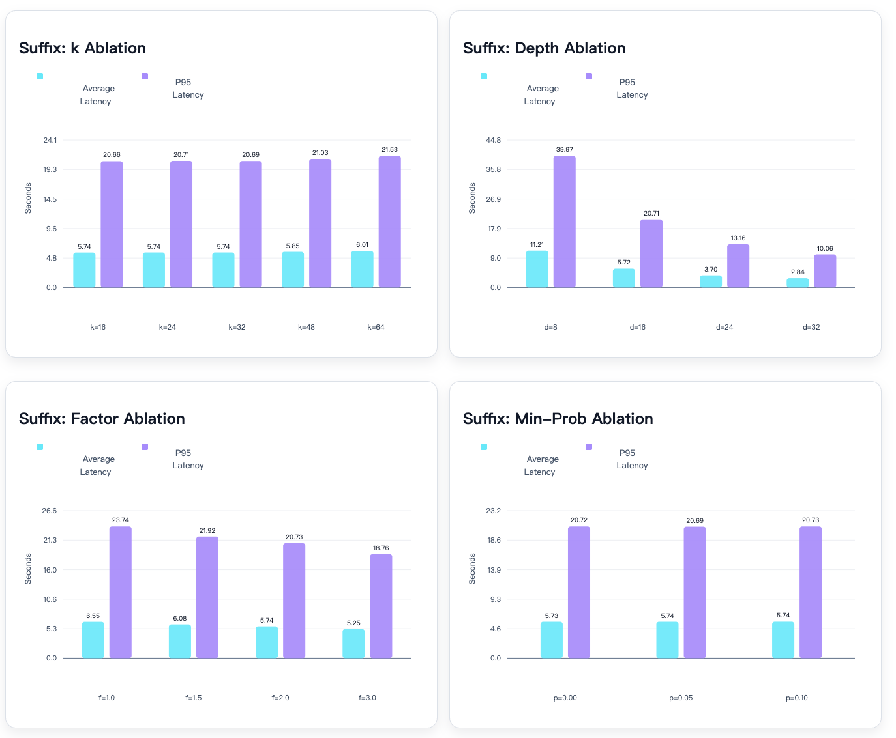
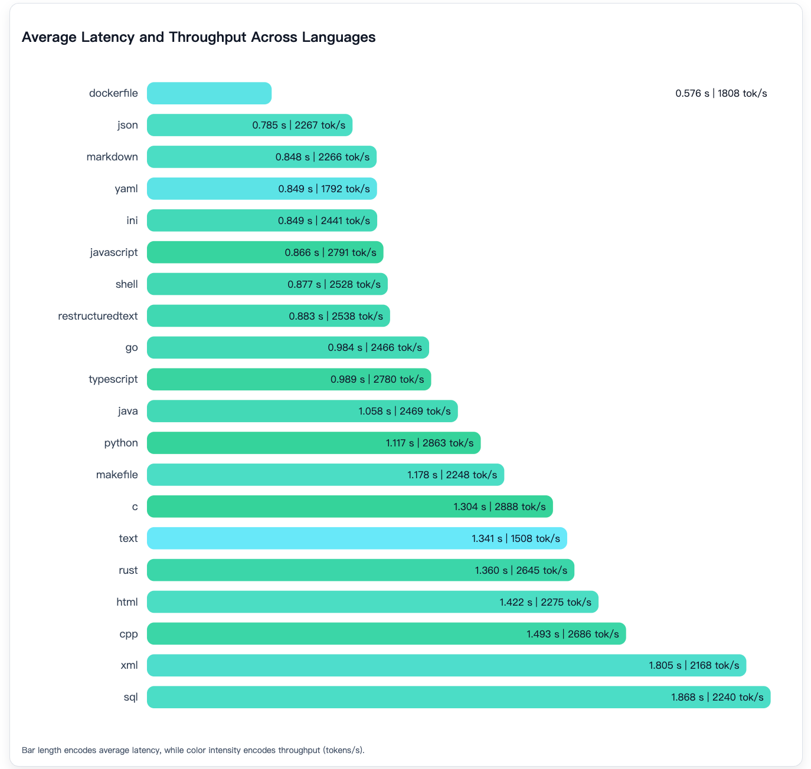
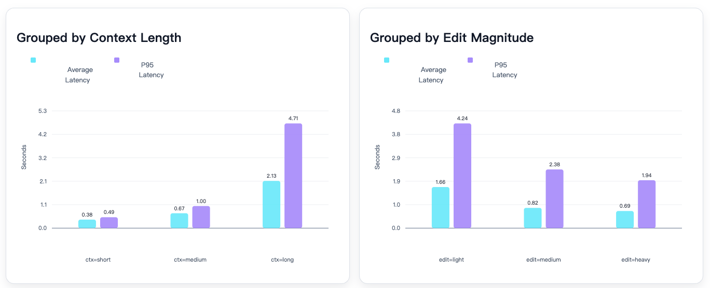

# aiXapply Experiment Results

This document summarizes the main experimental findings for **aiXapply**. It complements the runnable scripts in `experiments/` by collecting the benchmark numbers, inference-efficiency results, generalization tests, and training-method comparisons in one place.

## Scope

The experiments answer four questions:

- **RQ1: Why full-file Apply?** Compare full-file Apply with `unified diff` and `search-and-replace`.
- **RQ2: Can a 4B Apply model reach strong accuracy?** Evaluate aiXapply across 20 languages/file formats.
- **RQ3: Can full-file Apply be efficient enough for IDE workflows?** Measure latency and throughput under speculative decoding.
- **RQ4: What training strategy works best?** Compare SFT and RL / GRPO across in-distribution and out-of-distribution settings.

## Experimental Setup

All main Apply experiments use the same structured input/output contract:

```text
<language>{language}</language>
<source_file>{source_file}</source_file>
<update_snippet>{update_snippet}</update_snippet>

-> <update_file>{full updated file}</update_file>
```

### Datasets

| Dataset | Samples | Purpose |
| --- | ---: | --- |
| Main aiXapply test set | 1,637 | Main benchmark across 20 languages/file formats. |
| Random Placeholders | 1,637 | Tests robustness to varied placeholder markers. |
| Chunk File | 1,637 | Tests Apply when only a selected code chunk / partial context is available. |
| Long Context / Large File | 51 | Tests long-context stability. |
| Untrained Languages | 647 | Tests transfer to PHP, CSS, SystemVerilog, and C#. |
| Fast-Apply test set | 200 | External transfer check; includes noisy / ambiguous cases. |
| Diff-XYZ | 1,000 | Tests cross-format generalization to unified-diff inputs. |

### Main Test Set Distribution

| Language / Format | Count | Percentage |
| --- | ---: | ---: |
| Java | 200 | 12.22% |
| JavaScript | 200 | 12.22% |
| Python | 195 | 11.91% |
| C | 130 | 7.94% |
| C++ | 128 | 7.82% |
| Go | 80 | 4.89% |
| JSON | 54 | 3.30% |
| XML | 50 | 3.05% |
| Shell | 50 | 3.05% |
| Markdown | 50 | 3.05% |
| Makefile | 50 | 3.05% |
| Text | 50 | 3.05% |
| INI | 50 | 3.05% |
| reStructuredText | 50 | 3.05% |
| Dockerfile | 50 | 3.05% |
| TypeScript | 50 | 3.05% |
| SQL | 50 | 3.05% |
| Rust | 50 | 3.05% |
| YAML | 50 | 3.05% |
| HTML | 50 | 3.05% |
| **Total** | **1,637** | **100.00%** |

### Metric

The primary metric is **equivalence accuracy**:

- Code files are compared with Pygments-token equivalence.
- Structured formats such as JSON, YAML, XML, and INI are parsed or normalized when appropriate.
- Failures are classified into six error categories: `OUTPUT_INVALID`, `PATCH_NOT_APPLIED`, `PATCH_INCOMPLETE`, `PATCH_INCORRECT`, `WRONG_POSITION`, and `OUT_OF_PATCH_SIDE_EFFECT`.

For inference-efficiency experiments, we additionally report:

- **Avg latency**: mean per-request wall-clock latency.
- **P95 latency**: 95th percentile per-request latency.
- **Avg output tokens**: average generated token count per sample.
- **Throughput**: total generated tokens divided by total wall-clock time.
- **Avg speedup**: latency speedup over the no-speculation baseline when available.

Parameter searches use a language-stratified 10% subset of the main test set (`165` examples, sampled with seed `42`). Final stability checks use the full `1,637`-example test set.

## RQ1: Editing-Paradigm Comparison

The first experiment compares three code-integration representations:

- `unified diff`: compact but structurally brittle.
- `search-and-replace`: shorter and useful in agent loops, but requires exact original-fragment matching.
- full-file Apply: highest one-shot accuracy, but produces longer outputs.


*Figure 1: Accuracy-latency comparison across unified diff, search-and-replace, and full-file Apply. aiXapply-RL preserves full-file Apply accuracy while reducing latency to the interactive range.*

### Average Accuracy

| Model | Unified diff | Search-and-replace | Full-file Apply |
| --- | ---: | ---: | ---: |
| DeepSeek-V3.2 | 0.560 | 0.749 | 0.916 |
| GLM-5 | 0.649 | 0.905 | 0.921 |
| Kimi-K2.5 | 0.734 | 0.821 | 0.971 |
| Qwen3.5-397B-A17B | 0.644 | 0.866 | 0.948 |

For DeepSeek-V3.2, moving from `search-and-replace` to full-file Apply improves accuracy by about **17.5 percentage points**. This supports the core design choice: if one-shot correctness is the priority, full-file Apply is the most reliable target representation.

### Output Length and Latency

| Model | Diff tokens | Diff latency | S&R tokens | S&R latency | Apply tokens | Apply latency |
| --- | ---: | ---: | ---: | ---: | ---: | ---: |
| DeepSeek-V3.2 | 462 | 14.22s | 926 | 28.48s | 3684 | 108.96s |
| GLM-5 | 437 | 12.98s | 512 | 13.38s | 3646 | 51.33s |
| Kimi-K2.5 | 483 | 19.04s | 596 | 22.64s | 3680 | 79.69s |
| Qwen3.5-397B | 460 | 5.82s | 902 | 11.21s | 3674 | 35.90s |
| aiXapply-RL | -- | -- | -- | -- | 3734 | 1.44s |

Full-file Apply improves correctness but is expensive for large API-served models. aiXapply closes this gap by specializing a 4B model and using task-aligned speculative decoding.

## RQ2: Main Benchmark Accuracy

The main benchmark compares general code models, strong closed/open baselines, prior Apply-specific models, and aiXapply variants.

| Language | Qwen3-4B | DeepSeek-V3.2 | Qwen3.5-397B | Kimi-K2.5 | GLM-5 | aiXapply-RL | aiXapply-SFT | Fast-Apply-7B |
| --- | ---: | ---: | ---: | ---: | ---: | ---: | ---: | ---: |
| C | 0.66 | 0.915 | 0.946 | 0.992 | 0.931 | 0.96 | 0.93 | 0.546 |
| C++ | 0.66 | 0.914 | 0.977 | 0.953 | 0.945 | 0.92 | 0.945 | 0.539 |
| Dockerfile | 0.68 | 0.94 | 1.00 | 1.00 | 0.96 | 1.00 | 1.00 | 0.74 |
| Go | 0.65 | 0.937 | 0.95 | 0.975 | 0.963 | 0.93 | 0.912 | 0.65 |
| HTML | 0.64 | 0.84 | 0.96 | 0.96 | 0.92 | 0.86 | 0.96 | 0.60 |
| INI | 0.50 | 0.88 | 0.94 | 0.96 | 0.98 | 0.92 | 0.96 | 0.64 |
| Java | 0.71 | 0.955 | 0.945 | 0.985 | 0.95 | 0.95 | 0.93 | 0.545 |
| JavaScript | 0.71 | 0.934 | 0.96 | 0.98 | 0.93 | 0.97 | 0.965 | 0.73 |
| JSON | 0.81 | 0.944 | 1.00 | 1.00 | 0.944 | 0.96 | 1.00 | 0.814 |
| Makefile | 0.62 | 0.92 | 0.98 | 0.98 | 0.98 | 0.92 | 0.94 | 0.56 |
| Markdown | 0.54 | 0.82 | 0.90 | 0.94 | 0.88 | 0.90 | 0.88 | 0.66 |
| Python | 0.69 | 0.928 | 0.933 | 0.969 | 0.897 | 0.91 | 0.933 | 0.626 |
| reStructuredText | 0.52 | 0.88 | 0.86 | 0.92 | 0.86 | 0.88 | 0.90 | 0.64 |
| Rust | 0.48 | 0.90 | 0.90 | 0.94 | 0.82 | 0.90 | 0.90 | 0.46 |
| Shell | 0.58 | 0.92 | 0.98 | 0.98 | 0.92 | 0.98 | 0.92 | 0.66 |
| SQL | 0.60 | 0.84 | 0.94 | 1.00 | 0.92 | 0.96 | 0.96 | 0.60 |
| Text | 0.54 | 0.90 | 0.88 | 0.90 | 0.86 | 1.00 | 0.96 | 0.64 |
| TypeScript | 0.62 | 0.96 | 0.92 | 0.96 | 0.94 | 0.88 | 0.98 | 0.48 |
| XML | 0.76 | 0.86 | 1.00 | 0.98 | 0.78 | 0.98 | 0.98 | 0.62 |
| YAML | 0.54 | 0.92 | 0.96 | 0.98 | 0.90 | 0.96 | 0.98 | 0.76 |
| **Average** | **0.626** | **0.916** | **0.948** | **0.971** | **0.921** | **0.938** | **0.944** | **0.620** |

Task-specific training closes most of the gap between the 4B backbone and much larger models. aiXapply-SFT and aiXapply-RL both substantially outperform the untrained Qwen3-4B baseline and Fast-Apply-7B.

## Error Analysis

On the main test set, most wrong outputs are concentrated in `OUT_OF_PATCH_SIDE_EFFECT` and `PATCH_INCOMPLETE`, meaning models either modify unrelated regions or fail to apply all intended changes.

| Error Type | DeepSeek-V3.2 | Qwen3-4B | aiXapply-RL | Qwen3.5-397B | Kimi-K2.5 | GLM-5 |
| --- | ---: | ---: | ---: | ---: | ---: | ---: |
| `OUTPUT_INVALID` | 10.22% | 12.35% | 4.76% | 3.53% | 10.64% | 30.00% |
| `PATCH_NOT_APPLIED` | 5.11% | 8.29% | 9.52% | 9.41% | 0.00% | 0.77% |
| `PATCH_INCOMPLETE` | 18.98% | 12.87% | 27.61% | 22.35% | 21.28% | 9.23% |
| `PATCH_INCORRECT` | 8.03% | 4.06% | 11.43% | 7.06% | 4.26% | 2.31% |
| `WRONG_POSITION` | 3.65% | 5.64% | 10.48% | 11.76% | 6.38% | 2.31% |
| `OUT_OF_PATCH_SIDE_EFFECT` | 54.01% | 56.79% | 36.19% | 45.88% | 57.45% | 55.38% |

The Apply task is strict: even if code outside the patch looks improvable, it must remain unchanged. Training reduces side effects and invalid outputs, aligning model behavior with IDE review expectations.

## Generalization Benchmarks

| Dataset | Qwen3-4B | DeepSeek-V3.2 | aiXapply-RL | aiXapply-SFT |
| --- | ---: | ---: | ---: | ---: |
| Main aiXapply test set | 0.626 | 0.916 | 0.9382 | 0.944 |
| Random Placeholders | 0.696 | 0.932 | 0.948 | 0.951 |
| Chunk File | 0.5247 | 0.875 | 0.886 | 0.900 |
| Untrained Languages | 0.6399 | 0.932 | 0.938 | 0.941 |
| Long Context | 0.2353 | 0.588 | 0.6471 | 0.843 |

SFT is notably stronger on long-context Apply, likely because every output token receives direct supervision and the model learns stronger full-file preservation behavior. RL remains competitive in most settings and shows stronger cross-format behavior in Diff-XYZ.

### Untrained Languages

| Model | C# | CSS | PHP | SystemVerilog | Average |
| --- | ---: | ---: | ---: | ---: | ---: |
| Qwen3-4B | 0.6356 | 0.623 | 0.6409 | 0.6695 | 0.6399 |
| DeepSeek-V3.2 | 0.889 | 0.963 | 0.927 | 0.932 | 0.932 |
| aiXapply-RL | 0.890 | 0.958 | 0.936 | 0.958 | 0.938 |
| aiXapply-SFT | 0.924 | 0.937 | 0.946 | 0.958 | 0.941 |

## RQ3: Inference Efficiency

Full-file Apply is copy-dominant: most output tokens are copied from the original file. This makes it a strong fit for speculative decoding.

### Speculative Decoding Comparison



*Figure 2: Baseline, suffix decoding, and n-gram speculative decoding compared by average latency, P95 latency, and throughput.*

| Method | Config | Avg Latency | P95 Latency | Throughput | Avg Speedup |
| --- | --- | ---: | ---: | ---: | ---: |
| Baseline | No speculation | 28.831s | 90.230s | 102.04 tok/s | 1x |
| Suffix default | `k=32, depth=16` | 5.751s | 20.741s | 509.54 tok/s | 5.01x |
| N-gram default | `n=16, k=32` | 2.168s | 6.935s | 1343.99 tok/s | 13.3x |
| Suffix best | `k=32, depth=32` | 2.842s | 10.062s | 1028.79 tok/s | 10.14x |
| N-gram best | `n=7, k=128` | 1.06s | 3.381s | 2692.01 tok/s | 27.19x |

N-gram speculative decoding is the best fit for aiXapply because it directly exploits repeated substrings from the prompt/source file. The final recommended configuration is **`n=7, k=128`**.

### N-gram Parameter Search



*Figure 3: N-gram average latency heatmap. Increasing `k` helps substantially, and `n=7, k=128` is the best searched configuration.*

With fixed `k=32`, `n=7~12` enters a stable high-performance range:

| Config | Avg Latency | P95 Latency | Throughput |
| --- | ---: | ---: | ---: |
| `n=1, k=32` | 9.901s | 41.749s | 296.74 tok/s |
| `n=3, k=32` | 2.938s | 11.849s | 994.75 tok/s |
| `n=7, k=32` | 2.255s | 7.658s | 1294.09 tok/s |
| `n=12, k=32` | 2.137s | 6.785s | 1365.04 tok/s |
| `n=16, k=32` | 2.177s | 6.982s | 1340.56 tok/s |

With fixed `n=7`, increasing `k` consistently improves latency up to the searched maximum:

| Config | Avg Latency | P95 Latency | Throughput |
| --- | ---: | ---: | ---: |
| `n=7, k=16` | 3.799s | 13.399s | 771.09 tok/s |
| `n=7, k=48` | 1.724s | 5.693s | 1688.80 tok/s |
| `n=7, k=64` | 1.443s | 4.793s | 2012.70 tok/s |
| `n=7, k=96` | 1.160s | 4.009s | 2492.26 tok/s |
| `n=7, k=128` | 1.092s | 3.328s | 2649.89 tok/s |

### Suffix Parameter Search



*Figure 4: Suffix decoding ablations. `depth` is the dominant parameter, while `k` and `min_token_prob` have much weaker effects.*

Suffix decoding also benefits from the copy-dominant structure of Apply, but its best setting remains behind n-gram speculation.

With `k` ablation, suffix decoding is not very sensitive to the number of speculative tokens:

| Config | Avg Latency | P95 Latency | Throughput |
| --- | ---: | ---: | ---: |
| `k=16` | 5.735s | 20.660s | 511.57 tok/s |
| `k=24` | 5.738s | 20.707s | 511.26 tok/s |
| `k=32` | 5.736s | 20.690s | 511.25 tok/s |
| `k=48` | 5.846s | 21.032s | 501.88 tok/s |
| `k=64` | 6.006s | 21.532s | 488.36 tok/s |

The most important suffix parameter is `depth`:

| Config | Avg Latency | P95 Latency | Throughput |
| --- | ---: | ---: | ---: |
| `depth=8` | 11.212s | 39.973s | 262.07 tok/s |
| `depth=16` | 5.725s | 20.708s | 512.12 tok/s |
| `depth=24` | 3.699s | 13.159s | 791.93 tok/s |
| `depth=32` | 2.842s | 10.062s | 1028.79 tok/s |

`max_spec_factor` has a smaller but positive effect:

| Config | Avg Latency | P95 Latency | Throughput |
| --- | ---: | ---: | ---: |
| `factor=1.0` | 6.551s | 23.743s | 448.04 tok/s |
| `factor=1.5` | 6.082s | 21.923s | 482.52 tok/s |
| `factor=2.0` | 5.735s | 20.731s | 511.40 tok/s |
| `factor=3.0` | 5.245s | 18.756s | 559.08 tok/s |

`min_token_prob` has almost no effect in this setting:

| Config | Avg Latency | P95 Latency | Throughput |
| --- | ---: | ---: | ---: |
| `min_prob=0.00` | 5.727s | 20.723s | 512.17 tok/s |
| `min_prob=0.05` | 5.736s | 20.694s | 511.29 tok/s |
| `min_prob=0.10` | 5.743s | 20.726s | 510.78 tok/s |

### Stability by Language



*Figure 5: Average latency and throughput across languages under the best n-gram configuration.*

With the best configuration on the full 1,637-example test set:

| Language | Samples | Avg Latency | P95 Latency | Avg Output Tokens | Throughput |
| --- | ---: | ---: | ---: | ---: | ---: |
| Overall | 1,637 | 1.06s | 3.381s | 2853.4 | 2692.01 tok/s |
| C | 130 | 1.304s | 3.533s | 3832.4 | 2888.11 tok/s |
| C++ | 128 | 1.493s | 4.370s | 4076.1 | 2686.26 tok/s |
| Java | 200 | 1.058s | 3.364s | 2666.1 | 2469.23 tok/s |
| JavaScript | 200 | 0.866s | 2.603s | 2464.1 | 2791.22 tok/s |
| Python | 195 | 1.118s | 3.568s | 3259.7 | 2863.29 tok/s |
| SQL | 50 | 1.868s | 5.687s | 4231.5 | 2240.44 tok/s |
| XML | 50 | 1.805s | 5.818s | 3959.8 | 2168.34 tok/s |

All language groups completed successfully. Performance variation mostly follows output length and file structure rather than language-specific failures.

### Stability by Context Length



*Figure 6: Latency grouped by source context length and edit magnitude. Longer/light-edit cases generate more copied tokens and therefore have higher absolute latency.*

The full test set is split into three buckets by source-token count:

- `short`: `source_tokens <= 1077.6667`
- `medium`: `1077.6667 < source_tokens <= 2808.6667`
- `long`: `source_tokens > 2808.6667`

| Bucket | Samples | Avg Latency | P95 Latency | Avg Output Tokens | Throughput |
| --- | ---: | ---: | ---: | ---: | ---: |
| Overall | 1,637 | 1.06s | 3.381s | 2853.4 | 2692.01 tok/s |
| Short | 546 | 0.383s | 0.491s | 724.0 | 1846.52 tok/s |
| Medium | 545 | 0.670s | 0.996s | 1860.1 | 2698.99 tok/s |
| Long | 546 | 2.126s | 4.715s | 5974.4 | 2768.57 tok/s |

Longer files naturally increase absolute latency because more tokens must be generated, but throughput remains stable around `2700 tok/s` for medium and long examples. This suggests that n-gram speculation continues to work under long-context generation.

### Stability by Edit Ratio

The full test set is also split by edit ratio:

- `light`: `edit_ratio <= 0.053937`
- `medium`: `0.053937 < edit_ratio <= 0.135440`
- `heavy`: `edit_ratio > 0.135440`

| Bucket | Samples | Avg Latency | P95 Latency | Avg Output Tokens | Throughput |
| --- | ---: | ---: | ---: | ---: | ---: |
| Overall | 1,637 | 1.06s | 3.381s | 2853.4 | 2692.01 tok/s |
| Light | 546 | 1.665s | 4.242s | 4848.7 | 2866.08 tok/s |
| Medium | 545 | 0.820s | 2.377s | 2175.8 | 2604.06 tok/s |
| Heavy | 546 | 0.694s | 1.941s | 1534.6 | 2169.77 tok/s |

Light edits are not necessarily fastest: they often require copying long unchanged files, so they produce the most output tokens. The high throughput across all buckets indicates that the best n-gram setting is stable across both low-edit and high-edit examples.

## RQ4: SFT vs RL

SFT and RL are complementary:

- **SFT** is stronger for in-distribution Apply accuracy and long-context preservation.
- **RL** improves locality and cross-format robustness, especially in Diff-XYZ.

### Diff-XYZ Cross-Format Generalization

| Model | Overall | Java | JavaScript | Kotlin | Python | Rust |
| --- | ---: | ---: | ---: | ---: | ---: | ---: |
| Qwen3-4B | 0.596 | 0.630 | 0.610 | 0.620 | 0.590 | 0.530 |
| aiXapply-SFT | 0.479 | 0.510 | 0.470 | 0.490 | 0.425 | 0.500 |
| aiXapply-RL | 0.664 | 0.680 | 0.715 | 0.655 | 0.645 | 0.625 |

RL improves diff-format understanding even without explicit diff-format training, while SFT specializes more strongly to the full-file Apply prompt format.

## External Transfer: Fast-Apply Test Set

The Fast-Apply test set is useful as an external stress test but contains ambiguous or noisy cases for strict full-file Apply. Manual inspection of sampled failures found multiple cases where the reference was non-unique or the patch lacked enough anchoring context.

| Model | Accuracy |
| --- | ---: |
| DeepSeek3.2 | 0.66 |
| Fast-Apply | 0.46 |
| aiXapply-RL | 0.525 |
| aiXapply-SFT | 0.52 |

These scores should be interpreted as external-validity stress results, not as a primary leaderboard for aiXapply.

## Takeaways

1. Full-file Apply provides the best one-shot accuracy among the tested edit representations.
2. A specialized 4B model can approach much larger models on the Apply task.
3. Most failure modes come from unintended side effects and incomplete patch application.
4. N-gram speculative decoding is highly effective because Apply outputs are copy-dominant.
5. SFT and RL have different strengths: SFT preserves long files better, while RL transfers better to alternative edit formats.
